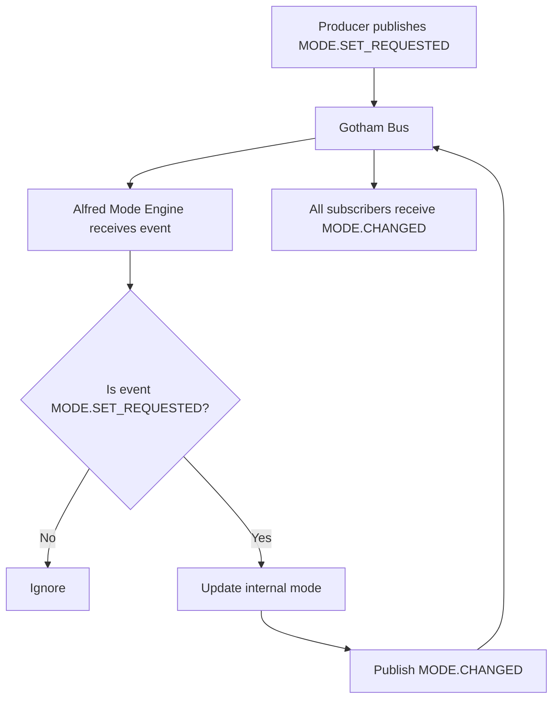

# 🦇 Batcave-OS — Architecture (Simple + Visual)

This document explains Batcave-OS in **plain language** with **diagrams**.

> **Everything talks by events.**  
> Producers publish. Consumers react. Nobody calls each other directly.

---

## 1) Mental Model

### 🏟 The “Room” analogy

- **Gotham Bus** = the room’s speaker system  
- **Events** = the things shouted into the room  
- **Services/Adapters** = people in the room who *listen* and *react*

If nobody is listening, nothing happens.  
If many are listening, they can all react **independently**.

---

## 2) The Big Picture Diagram

```
                (UI / Triggers)
     Dashboard / Voice / Gesture / Dev
                 │   publish events
                 ▼
            ┌───────────┐
            │ Gotham Bus │   (pub/sub transport)
            └─────┬─────┘
                  │ delivers events
                  ▼
        ┌─────────────────────┐
        │ Alfred Mode Engine   │  (state machine brain)
        └─────┬───────────────┘
              │ publishes MODE.CHANGED
              ▼
   ┌───────────────────┐   ┌───────────────────┐
   │ Integrations       │   │ Apps / Logging     │
   │ (Govee, Plug, etc)│   │ (Dashboard, logs)  │
   └─────────┬─────────┘   └───────────────────┘
             │
             ▼
        Hardware / Devices
```

**Rule:** Integrations touch hardware.  
**Rule:** Alfred decides modes.  
**Rule:** The bus only transports events.

---

## 3) Current Implementation Flow (What Works Today)

✅ Implemented right now:

- `MODE.SET_REQUESTED` → Alfred reacts → `MODE.CHANGED`

### Sequence Diagram (Simple)

```
dev.ts            Gotham Bus            Alfred
  |                  |                    |
  | publish SET      |                    |
  |----------------->|                    |
  |                  | deliver SET        |
  |                  |------------------->|
  |                  |                    | update internal mode
  |                  |                    | publish CHANGED
  |                  |<-------------------|
  | deliver CHANGED  |                    |
  |<-----------------|                    |
  | console prints   |                    |
```

### Quick “State Change” view

```
Current mode: WORK
Event: MODE.SET_REQUESTED(DEMO)
Alfred updates: WORK -> DEMO
Alfred publishes: MODE.CHANGED(prev=WORK, mode=DEMO)
```

---

## 4) Event Types (The Language)

Events are the **shared vocabulary** of the entire system.

### Current Contract

- `MODE.SET_REQUESTED` — request a mode change
- `MODE.CHANGED` — announce the mode actually changed

Modes:

- `WORK`, `DEFENSE`, `NIGHT`, `DEMO`, `SILENT`

### Event Examples

**Request:**
```json
{
  "type": "MODE.SET_REQUESTED",
  "ts": "2026-02-14T16:36:18.109Z",
  "source": "dev",
  "mode": "DEMO"
}
```

**State transition announcement:**
```json
{
  "type": "MODE.CHANGED",
  "ts": "2026-02-14T16:36:18.114Z",
  "source": "alfred-mode-engine",
  "mode": "DEMO",
  "prevMode": "WORK"
}
```

---

## 5) What Each Component Is Allowed To Do

### Gotham Bus (Transport Only)
✅ Allowed:
- publish / subscribe
- deliver events

❌ Not allowed:
- decide modes
- talk to hardware
- enforce behavior

---

### Alfred Mode Engine (Brain / State Machine)
✅ Allowed:
- store current mode
- react to `MODE.SET_REQUESTED`
- publish `MODE.CHANGED`

❌ Not allowed:
- call Govee API directly
- call Smart Plug API directly
- contain UI code

---

### Integrations (Adapters / Hands)
✅ Allowed:
- listen to bus events
- talk to hardware APIs
- translate events → device commands

❌ Not allowed:
- decide what mode should be
- implement orchestration rules

---

### Apps (UI / Eyes)
✅ Allowed:
- display current mode and events
- publish requests (like mode changes)

❌ Not allowed:
- contain mode decision logic
- call hardware APIs

---

## 6) Mode Meaning (Simple)

| Mode   | Meaning |
|--------|---------|
| WORK   | Default operational state |
| DEFENSE| Alert mode |
| NIGHT  | Low-power / dim |
| DEMO   | Cinematic showcase |
| SILENT | System remains operational but suppresses visible or audible outputs (Do Not Disturb) |

Important: **SILENT is not OFF.**  
It means “run quietly.”

---

## 7) Flowchart (Easy Rules)



---

## 8) Repo Structure (Minimal)

```
batcave-os/
├─ apps/
│  └─ batcomputer-dashboard/      (UI)
├─ services/
│  ├─ gotham-bus/                 (pub/sub transport)
│  └─ alfred-mode-engine/         (state machine brain)
├─ integrations/
│  └─ govee-lights/               (hardware adapter)
└─ docs/
   └─ ARCHITECTURE.md             (this file)
```

---

## 9) What’s Next (Natural Next Steps)

The next “real” expansion is to have integrations react to `MODE.CHANGED`:

```
MODE.CHANGED
   ├─> govee-lights adapter sets scene/color
   ├─> smart-plug adapter toggles power (later)
   └─> dashboard displays mode + event log
```

That’s how the cave starts to “do” things — without coupling.

---

🦇 **The cave listens.**  
⚡ **Events move.**  
🧠 **Alfred decides.**  
💡 **Adapters act.**
